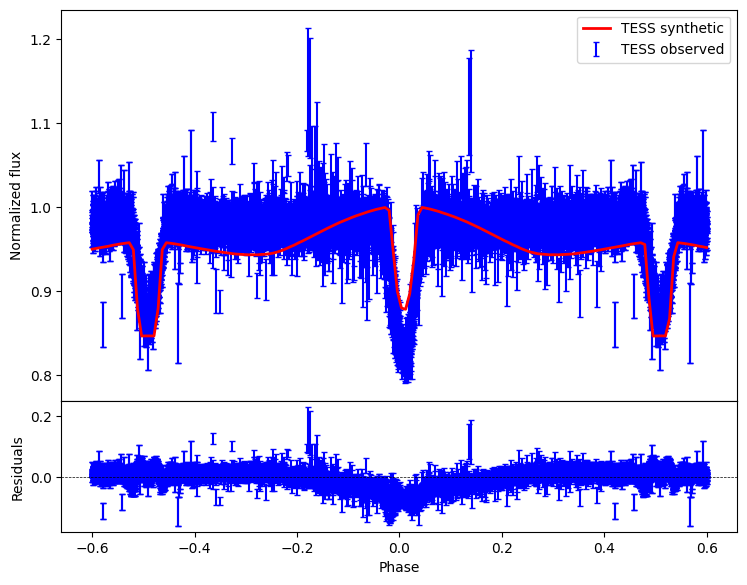
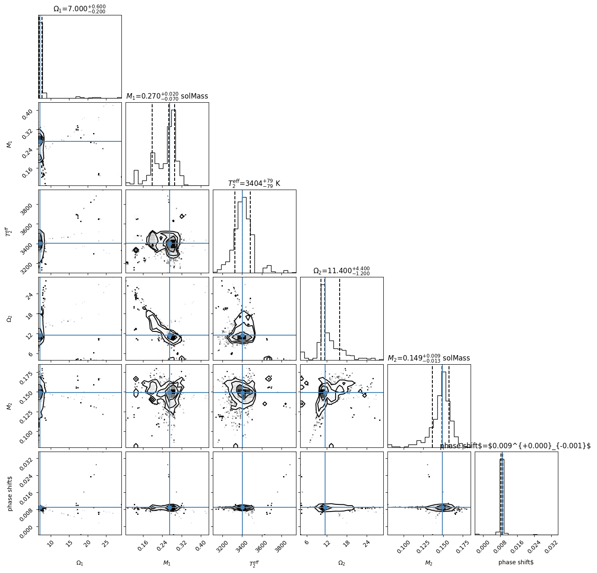

I've gotten ELISa to work. Here I will be documenting initial parameters and their results.
<ul>
  <li>Masses: from the Annual Review, M dwarf mass ranges from 0.075 to 0.61 solar masses. M_1 is allowed to vary through the whole range, M_2 is allowed to vary between 0.075 and 0.2</li>
  <li>Period: from TESS, 0.56631 days</li>
  <li>Eccentricity: assumed 0.0 deg</li>
  <li>Inclination: from TESS MAST data archive, 89.123 deg</li>
  <li>Metallicities: assumed 0.0 [M/H]</li>
  <li>Effective Temperatures: from TESS, 3325.0 K, not sure if this is for both components or just the primary, so keeping primary T_eff fixed and letting secondary T_eff vary</li>
  <li>Surface Potentials: not sure what this does, but narrowed down the allowed range of values to between 3 and 30. letting both components' vary</li>
  <li>Argument of Periastron: since we are assuming an eccentricity of 0.0 deg, this is also assumed to be 0.0 deg</li>
  <li>Phase Shift: initial is 0.0, allowed to vary from -0.02 to +0.02</li>
</ul>

This results in an R^2 value of 0.599224 in the Least Squares fit and an R^2 value of 0.80807 in the MCMC fit. I think the surface potentials need to be adjusted. I still don't totally know what they affect.

